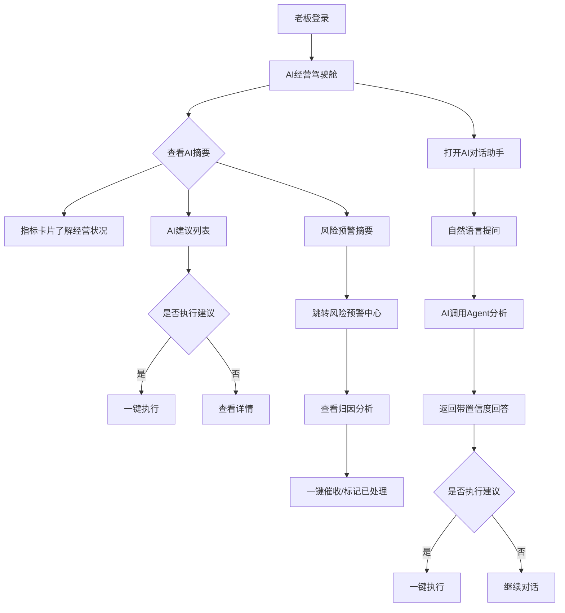
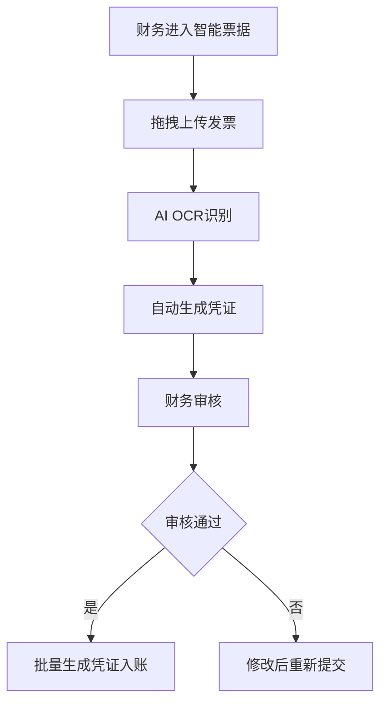
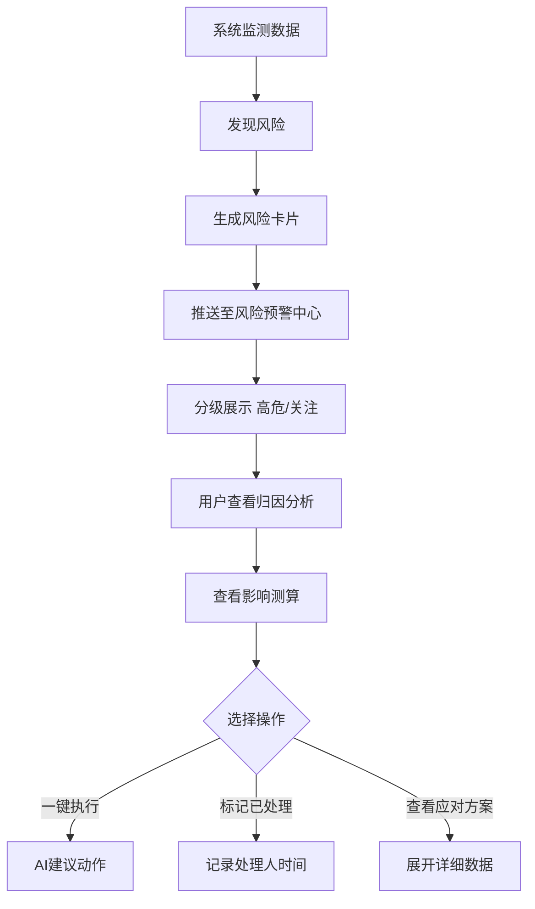

# 智擎（ZhiQing）SaaS 管理平台 - 产品需求文档（PRD）

## 1. 产品概述

智擎是一款面向年营收 500 万–2 亿元成长型中小企业的 AI 原生一站式经营管理 SaaS 平台。以 AI 为操作系统而非附加功能，所有业务模块原生接入大模型能力，通过 AI Agent 自主完成"发现问题—定位原因—生成方案—执行测试"的经营链路。覆盖商贸批发、零售连锁、轻制造、电商四个主力行业，让中小企业在一个平台上办完从出生到消亡的大部分事。

- **目标用户**：成长型中小企业老板及核心经营团队，有数字化意愿但缺乏专业 IT 团队
- **市场价值**：替代多套割裂系统，业财一体化数据底座 + 全生命周期一站式服务，结果导向透明定价

## 2. 核心功能

### 2.1 用户角色

| 角色 | 注册方式 | 核心权限 |
|------|---------|----------|
| 企业老板 | 平台开通账号 | 查看经营驾驶舱、风险预警、AI 助手、所有模块只读 |
| 财务负责人 | 管理员分配 | 财务模块全部权限、票据、报表、税务 |
| 业务负责人 | 管理员分配 | 采购、销售、库存、客户管理权限 |
| HR 负责人 | 管理员分配 | 考勤、薪酬、招聘、员工档案权限 |
| 普通员工 | 管理员分配 | 个人考勤、报销、申请等基础功能 |

### 2.2 功能模块（P0 优先级 - MVP 必做）

1. **AI 经营驾驶舱**：自然语言摘要 + 指标卡片 + AI 建议 + 风险预警摘要 + 待办事项
2. **风险预警中心**：分级风险卡片（高危/关注/已解除）+ 归因分析 + 一键执行
3. **智能票据**：OCR 上传 + 识别 + 凭证生成
4. **应收应付**：账龄热力图 + 回款预测 + 催收
5. **资金管理**：现金流预测图 + 缺口预警 + 调度建议
6. **采购管理**：采购订单 + 供应商管理 + AI 议价建议
7. **销售管理**：销售订单 + 多渠道同步 + 销售预测
8. **库存管理**：库存列表 + 滞销/临期标识 + AI 补货建议
9. **客户管理（CRM）**：客户列表 + 流失风险评分 + 挽回话术
10. **考勤排班**：打卡汇总 + 排班 + 工时统计
11. **薪酬核算**：薪资方案 + 社保计算 + 个税
12. **AI 对话助手**：全局悬浮侧边面板，自然语言驱动

### 2.3 页面详情

| 页面名称 | 模块名称 | 功能描述 |
|---------|---------|---------|
| AI 经营驾驶舱 | AI 经营摘要 | 深色渐变卡片，自然语言概述本月经营状况，高亮关键数字 |
| AI 经营驾驶舱 | 指标卡片 | 本月营收、毛利率、现金流、库存周转 4 个核心指标 + 环比 |
| AI 经营驾驶舱 | 营收趋势图 | ECharts 柱状图/折线图，6 个月趋势 |
| AI 经营驾驶舱 | AI 建议列表 | 每条带一键执行按钮 |
| AI 经营驾驶舱 | 风险预警摘要 | 高危/关注计数 + 跳转 |
| AI 经营驾驶舱 | 待办事项 | 审批/申报/到期提醒 |
| 风险预警中心 | 风险计数标签 | 高危 N / 关注 N / 已解除 N |
| 风险预警中心 | 风险卡片列表 | 等级标签、标题、时间、归因分析、影响测算、操作按钮 |
| 智能票据 | 批量上传区 | 拖拽上传发票图片/PDF |
| 智能票据 | 票据列表 | 日期/类型/金额/供应商/状态/操作 |
| 智能票据 | AI 识别预览 | OCR 识别信息 + 自动生成凭证 |
| 应收应付 | 总额卡片 | 应收/应付总额 + 账龄分布图 |
| 应收应付 | 账龄热力图 | 客户×账期矩阵，颜色深浅表示金额 |
| 应收应付 | 高风险清单 | 回款概率低于 50% 标红 |
| 资金管理 | 多账户总览 | 各账户资金余额卡片 |
| 资金管理 | 现金流预测图 | 实际/预测折线，安全水位与警戒水位线 |
| 资金管理 | 资金缺口预警 | 缺口金额 + 调度建议 |
| 采购管理 | 采购订单列表 | 订单号/供应商/金额/状态 |
| 采购管理 | 供应商管理 | 供应商评级 + AI 议价建议 |
| 销售管理 | 销售订单列表 | 订单号/客户/渠道/金额/状态 |
| 销售管理 | 多渠道同步 | 电商/线下/分销渠道汇总 |
| 库存管理 | 库存总览 | 总库存金额/周转率/滞销金额 |
| 库存管理 | 库存列表 | SKU/名称/库存量/可售天数/状态 |
| 库存管理 | AI 补货建议 | 基于销量预测的采购量建议 |
| 客户管理 | 客户总览 | 总数/活跃/流失风险卡片 |
| 客户管理 | 客户列表 | 客户名/联系人/最近下单/累计金额/流失风险评分 |
| 考勤排班 | 打卡汇总 | 出勤率/迟到/缺勤统计 |
| 考勤排班 | 排班表 | 周视图排班 |
| 考勤排班 | 工时统计 | 部门/个人工时汇总 |
| 薪酬核算 | 薪资方案 | 基本工资/绩效/补贴配置 |
| 薪酬核算 | 社保计算 | 五险一金自动计算 |
| 薪酬核算 | 个税计算 | 累计预扣法 |
| AI 对话助手 | 对话面板 | 用户消息右对齐 accent 色，AI 回复左对齐深色卡片 |
| AI 对话助手 | Agent 调用标识 | "智擎AI · 调用：XX Agent" |
| AI 对话助手 | 数据来源标注 | "数据来源：XX模块 · 置信度 XX%" |

## 3. 核心流程

### 3.1 老板日常经营决策流程

老板登录后第一屏看到 AI 经营驾驶舱，AI 已自动生成经营摘要并标注风险项。老板通过自然语言摘要快速了解本月状况，查看 AI 建议列表，对感兴趣的建议点击"一键执行"或"查看详情"。遇到疑问时点击右下角 AI 助手悬浮按钮，自然语言提问（如"下个月现金流够不够发工资"），AI 调用对应 Agent 实时分析并给出带数据来源与置信度的回答，支持一键执行建议动作。

### 3.2 财务票据处理流程

财务负责人进入智能票据页面，拖拽上传发票图片/PDF，AI 自动 OCR 识别发票信息并生成凭证，财务审核后批量生成凭证入账。

### 3.3 风险预警处理流程

系统自动监测各模块数据，发现风险（如账款逾期、库存滞销、现金流缺口）后生成风险卡片推送至风险预警中心，按严重程度分级展示。用户查看归因分析与影响测算，选择一键执行 AI 建议动作或标记已处理。

## 4. 用户界面设计

### 4.1 设计风格

- **主色调**：靛蓝紫 `#4F46E5`（主按钮、链接、选中态、品牌色），天蓝 `#0EA5E9`（次要强调、图表辅助色）
- **中性色**：页面背景 `#F5F7FB`，卡片背景 `#FFFFFF`，主文字 `#0E1525`，次要文字 `#5B6478`，分割线 `#E3E7F0`
- **语义色**：危险红 `#E0584C`，成功绿 `#16A37B`，警告橙 `#E08A1E`，AI 标签浅底 `#EEF0FE`
- **暗色模式**（AI 驾驶舱等沉浸式页面）：背景 `#0E1525 → #161E33 → #1E2A4A` 渐变，文字 `#DCE3F1`/`#8B95B0`
- **按钮风格**：主按钮 accent 色背景白字 8px 圆角，次按钮白底 1px 边框，文字按钮无背景无边框
- **字体**：标题 Outfit，正文 WorkSans，数字/代码 GeistMono；H1 27px/700，H2 19px/700，正文 16px/400 行高 1.7
- **布局风格**：左侧固定导航栏 240px + 顶部栏 56px + 主内容区，最大内容宽度 1040px 居中，卡片圆角 12px
- **图标风格**：Lucide React 线性图标，克制不花哨
- **AI 元素视觉**：✦ AI 前缀标签 accent 色，AI 摘要卡片深色渐变背景，AI 建议左侧 ▸ 箭头，AI 预测虚线表示，置信度低于 70% 标橙

### 4.2 页面设计概览

| 页面名称 | 模块名称 | UI 元素 |
|---------|---------|---------|
| AI 经营驾驶舱 | AI 经营摘要 | 深色渐变卡片 `#1E2A4A → #2A1E4A`，白色文字，关键数字加粗，风险项 amber/warn 高亮 |
| AI 经营驾驶舱 | 指标卡片 | 白色卡片 12px 圆角，数值 + 环比变化，正向 ok 色负向 warn 色 |
| AI 经营驾驶舱 | 营收趋势图 | ECharts 柱状图/折线图，颜色从 CSS 变量派生，animation: false |
| AI 经营驾驶舱 | AI 建议列表 | 白色卡片，每条左侧 ▸ 箭头，右侧一键执行按钮 |
| 风险预警中心 | 高危卡片 | 深红背景 `#2A1A1A`，红色边框 `#5C2A2A` |
| 风险预警中心 | 关注卡片 | 深橙背景 `#2A241A`，橙色边框 `#5C4A2A` |
| 智能票据 | 上传区 | 虚线边框拖拽区，accent 色高亮 |
| 应收应付 | 账龄热力图 | ECharts 热力图，客户×账期矩阵 |
| 资金管理 | 现金流预测图 | ECharts 折线图，实际实线预测虚线，安全/警戒水位线 |
| 库存管理 | 库存列表 | 表格行滞销标红临期标橙 |
| 客户管理 | 流失风险 | 评分高的客户标红，带 AI 挽回话术 |
| AI 对话助手 | 用户消息 | 右对齐 accent 色背景白字圆角气泡 |
| AI 对话助手 | AI 回复 | 左对齐深色卡片背景浅色文字，顶部 Agent 标识 |

### 4.3 响应式

- **桌面端（≥1280px）**：完整布局，侧边栏 240px + 多列网格
- **平板端（768–1279px）**：侧边栏可折叠为图标条，网格降为 2 列
- **移动端（<768px）**：底部 Tab 导航，单列布局，AI 助手全屏展开
- **打印**：隐藏导航与交互元素，适合打印经营报告

### 4.4 交互设计原则

1. **数据先于功能**：每个页面先展示经营数据洞察，再展示操作功能
2. **智能先于录入**：能 AI 自动完成的，不让用户手动输入
3. **一句话胜过一张表**：关键结论用自然语言摘要呈现，数据表格作为下钻详情
4. **行动导向**：每个洞察都附带可执行的操作按钮
5. **渐进式披露**：首屏展示摘要，点击展开详情

### 4.5 动效规范

- 页面切换淡入淡出 200ms
- 卡片 hover 轻微上浮 + 阴影加深 transition 150ms
- 数据加载用骨架屏 skeleton 不用 spinner
- 图表直接渲染 animation: false
- 风险预警从右侧滑入
- AI 回复打字机效果逐字显示
- 按钮点击 scale(0.97) 反馈

## 5. AI 能力体现

### 5.1 AI 元素视觉规范

- AI 标识：使用 "✦ AI" 或 "智擎AI" 前缀标签，accent 色
- AI 摘要卡片：深色渐变背景，与白色数据卡片区分
- AI 建议：左侧带 ▸ 箭头符号，每条带一键执行按钮
- AI 预测数据：虚线表示预测部分，实线表示实际数据
- 置信度标识：所有 AI 预测附带置信度百分比，低于 70% 标橙提示
- 数据来源：AI 回答底部标注"数据来源：XX模块 · 置信度 XX%"

### 5.2 人工监督（Human-in-the-loop）

涉及不可逆操作（资金调拨、合同签署、凭证删除）时：
- AI 生成建议但不自动执行
- 显示"需人工确认"标签
- 提供确认/修改/拒绝三个操作
- 确认后记录操作人与时间戳

## 6. 交付要求

1. 实现完整的左侧导航栏与路由结构
2. 实现 P0 优先级的全部 12 个页面
3. 每个页面使用真实感的模拟数据（中国企业场景，金额单位为人民币万元）
4. AI 相关元素按第五节规范实现视觉区分
5. 所有图表使用 ECharts，颜色从 CSS 变量派生
6. 实现响应式布局，至少支持桌面端与平板端
7. AI 对话助手作为全局组件，在任何页面都可调用
8. 代码结构清晰，组件可复用，样式通过 Tailwind + CSS 变量管理
