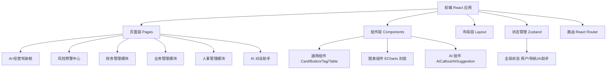

# 智擎（ZhiQing）SaaS 管理平台 - 技术架构文档

## 1. 架构设计

本项目为纯前端 SaaS 管理平台，使用 React + TypeScript + Vite + Tailwind CSS 技术栈，所有数据使用模拟数据（mock data），不涉及后端服务。



## 2. 技术栈说明

- **前端框架**：React 18 + TypeScript
- **构建工具**：Vite
- **样式方案**：Tailwind CSS 3 + CSS 变量（主题色通过 CSS 变量管理）
- **路由**：react-router-dom v6
- **状态管理**：Zustand
- **图表库**：ECharts 5（renderer: svg，从 CSS 变量读取颜色）
- **动效**：Framer Motion
- **图标**：lucide-react
- **字体**：Outfit（标题）+ WorkSans（正文）+ GeistMono（数字/代码）
- **初始化工具**：vite-init react-ts 模板
- **后端**：无（纯前端，使用 mock 数据）
- **数据库**：无（使用 mock 数据）

## 3. 路由定义

| 路由 | 用途 |
|------|------|
| `/` | 重定向到 `/dashboard` |
| `/dashboard` | AI 经营驾驶舱（首页） |
| `/risk` | 风险预警中心 |
| `/finance/invoices` | 智能票据 |
| `/finance/receivable` | 应收应付 |
| `/finance/cashflow` | 资金管理 |
| `/business/purchase` | 采购管理 |
| `/business/sales` | 销售管理 |
| `/business/inventory` | 库存管理 |
| `/business/crm` | 客户管理 |
| `/hr/attendance` | 考勤排班 |
| `/hr/payroll` | 薪酬核算 |
| `/settings` | 设置（占位） |

## 4. 目录结构

```
src/
├── components/              # 通用组件
│   ├── layout/              # 布局组件
│   │   ├── Sidebar.tsx      # 左侧导航栏
│   │   ├── Topbar.tsx       # 顶部栏
│   │   └── AppLayout.tsx    # 主布局容器
│   ├── ui/                  # 基础 UI 组件
│   │   ├── Card.tsx         # 卡片
│   │   ├── Button.tsx       # 按钮
│   │   ├── Tag.tsx          # 标签
│   │   ├── Table.tsx        # 表格
│   │   └── Callout.tsx      # 提示框
│   ├── charts/              # 图表组件
│   │   └── Chart.tsx        # ECharts 封装
│   └── ai/                  # AI 相关组件
│       ├── AICallout.tsx    # AI 提示框
│       ├── AISuggestion.tsx # AI 建议
│       └── AIAssistant.tsx  # 全局 AI 对话助手
├── pages/                   # 页面
│   ├── Dashboard.tsx        # AI 经营驾驶舱
│   ├── RiskCenter.tsx       # 风险预警中心
│   ├── finance/             # 财务模块
│   │   ├── Invoices.tsx
│   │   ├── Receivable.tsx
│   │   └── Cashflow.tsx
│   ├── business/            # 业务模块
│   │   ├── Purchase.tsx
│   │   ├── Sales.tsx
│   │   ├── Inventory.tsx
│   │   └── CRM.tsx
│   └── hr/                  # 人事模块
│       ├── Attendance.tsx
│       └── Payroll.tsx
├── store/                   # Zustand 状态管理
│   └── useAppStore.ts       # 全局状态（AI 助手开关、用户信息）
├── data/                    # 模拟数据
│   └── mockData.ts          # 各页面 mock 数据
├── styles/                  # 样式
│   └── globals.css          # 全局样式 + CSS 变量
├── utils/                   # 工具函数
│   └── format.ts            # 格式化工具
├── App.tsx                  # 根组件 + 路由
└── main.tsx                 # 入口
```

## 5. 设计系统实现

### 5.1 CSS 变量定义

在 `src/styles/globals.css` 中定义所有设计系统的 CSS 变量：

```css
:root {
  /* 主色调 */
  --accent: #4F46E5;
  --accent2: #0EA5E9;
  --accent-soft: #EEF0FE;

  /* 中性色 */
  --bg: #F5F7FB;
  --bg2: #FFFFFF;
  --ink: #0E1525;
  --muted: #5B6478;
  --rule: #E3E7F0;

  /* 语义色 */
  --warn: #E0584C;
  --warn-soft: #FDECEA;
  --ok: #16A37B;
  --ok-soft: #E4F6EF;
  --amber: #E08A1E;
  --amber-soft: #FBF0DD;

  /* 暗色模式 */
  --dark-bg1: #0E1525;
  --dark-bg2: #161E33;
  --dark-bg3: #1E2A4A;
  --dark-ink: #DCE3F1;
  --dark-muted: #8B95B0;
}
```

### 5.2 Tailwind 配置

在 `tailwind.config.js` 中将 CSS 变量映射为 Tailwind 颜色：

```js
colors: {
  accent: 'var(--accent)',
  accent2: 'var(--accent2)',
  'accent-soft': 'var(--accent-soft)',
  bg: 'var(--bg)',
  bg2: 'var(--bg2)',
  ink: 'var(--ink)',
  muted: 'var(--muted)',
  rule: 'var(--rule)',
  warn: 'var(--warn)',
  'warn-soft': 'var(--warn-soft)',
  ok: 'var(--ok)',
  'ok-soft': 'var(--ok-soft)',
  amber: 'var(--amber)',
  'amber-soft': 'var(--amber-soft)',
}
```

## 6. 数据模型

### 6.1 核心数据结构

由于使用 mock 数据，所有数据结构定义在 `src/data/mockData.ts` 中，使用 TypeScript interface 描述：

```typescript
// 经营指标
interface Metric {
  label: string;
  value: string;
  change: string;
  trend: 'up' | 'down' | 'neutral';
  unit?: string;
}

// 风险项
interface RiskItem {
  id: string;
  level: 'high' | 'medium' | 'resolved';
  title: string;
  time: string;
  description: string;
  analysis: string;
  impact: string;
  actions: { label: string; type: 'primary' | 'secondary' }[];
}

// 票据
interface Invoice {
  id: string;
  date: string;
  type: string;
  amount: number;
  supplier: string;
  status: 'pending' | 'recognized' | 'voucher';
}

// 应收应付
interface ReceivableItem {
  customer: string;
  amount: number;
  aging: { '0-30': number; '31-60': number; '61-90': number; '90+': number };
  recoveryRate: number;
}

// 客户
interface Customer {
  id: string;
  name: string;
  contact: string;
  lastOrder: string;
  totalAmount: number;
  churnRisk: number; // 0-100
}

// 库存
interface InventoryItem {
  sku: string;
  name: string;
  stock: number;
  daysAvailable: number;
  status: 'normal' | 'slow' | 'expiring';
}
```

### 6.2 AI 助手对话数据

```typescript
interface ChatMessage {
  id: string;
  role: 'user' | 'ai';
  content: string;
  agent?: string;        // 调用的 Agent 名称
  source?: string;       // 数据来源
  confidence?: number;   // 置信度 0-100
  actions?: { label: string; type: 'primary' | 'secondary' }[];
  timestamp: string;
}
```

## 7. 组件设计

### 7.1 布局组件

- **AppLayout**：主布局容器，包含 Sidebar + Topbar + 主内容区 + AIAssistant
- **Sidebar**：240px 固定导航栏，分组展示菜单，底部 Logo
- **Topbar**：56px 顶部栏，面包屑 + 全局搜索 + 通知 + 用户头像

### 7.2 通用 UI 组件

- **Card**：白色卡片，支持左侧色条变体
- **Button**：主/次/文字三种变体
- **Tag**：P0/P1/P2/AI 等语义标签
- **Table**：深色表头 + 奇偶行交替
- **Callout**：左侧色条 + 浅色背景提示框

### 7.3 图表组件

- **Chart**：ECharts 封装组件，接收 option prop，renderer: svg，animation: false，颜色从 CSS 变量读取

### 7.4 AI 组件

- **AICallout**：AI 提示框，深色渐变背景
- **AISuggestion**：AI 建议项，左侧 ▸ 箭头 + 一键执行按钮
- **AIAssistant**：全局悬浮对话面板，右下角按钮 + 侧边对话区

## 8. 关键实现要点

### 8.1 ECharts 颜色派生

所有 ECharts 图表颜色从 CSS 变量读取，不使用默认调色板：

```typescript
const styles = getComputedStyle(document.documentElement);
const accent = styles.getPropertyValue('--accent').trim();
const accent2 = styles.getPropertyValue('--accent2').trim();
```

### 8.2 AI 对话助手全局可用

AIAssistant 组件挂载在 AppLayout 中，通过 Zustand 控制开关，任何页面都可调用。支持：
- 自然语言提问
- 模拟 Agent 调用
- 打字机效果
- 数据来源与置信度标注
- 一键执行建议

### 8.3 响应式实现

使用 Tailwind 的响应式断点：
- `lg:` (≥1024px) 桌面端完整布局
- `md:` (768-1023px) 平板端折叠侧边栏
- 默认移动端单列

### 8.4 模拟数据真实感

所有 mock 数据使用中国企业场景：
- 公司名：华联商贸、东方零售等
- 金额单位：人民币万元
- 日期格式：YYYY-MM-DD
- 行业：商贸批发、零售连锁、轻制造、电商
