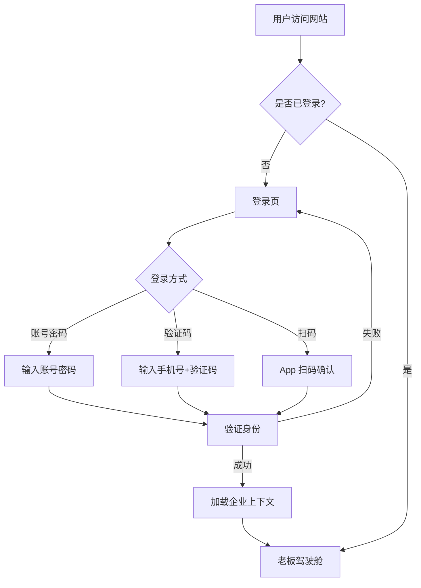
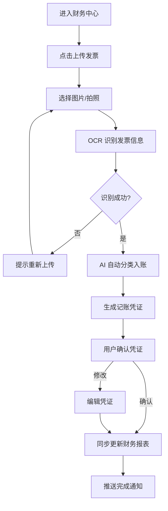
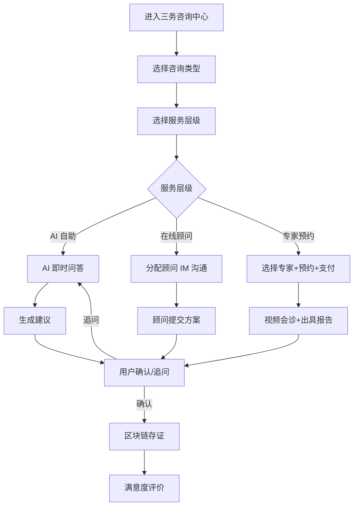
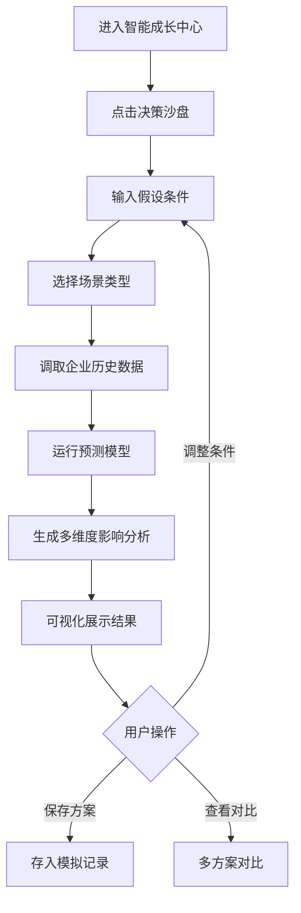

# 企管家 SaaS 管理后台 - 产品需求文档（PRD）

## 1. 产品概述

企管家 Web 管理后台是面向中国中小企业（年营收 100 万-5000 万）老板、财务负责人、行政管理人员的"一站式智能经营管家"云端管理平台。它将 App 端的十大服务板块与 AI 经营助手能力延伸到桌面端，提供更强大的数据看板、批量操作、报表导出与多门店管理能力，让老板在电脑前即可纵览全局、精准决策。

- **目标用户**：中小企业老板、财务负责人、行政管理人员
- **核心价值**：让老板少操心，让企业更赚钱；一个后台，管遍企业大小事
- **市场定位**：中小企业 SaaS 经营管理平台，三务顾问 + AI 成长助手

## 2. 核心功能

### 2.1 用户角色

| 角色 | 注册方式 | 核心权限 |
|------|----------|----------|
| 企业老板（超级管理员） | 邀制注册 | 全部模块查看与操作、成员管理、权限分配、订阅管理 |
| 财务负责人 | 老板邀请 | 财务、税务、金融、数据看板、三务咨询 |
| 行政管理人员 | 老板邀请 | 人力资源、供应链、营销、法律合规、政策服务 |
| 普通员工 | 老板邀请 | 个人考勤、薪酬查询、审批协作 |

### 2.2 功能模块

1. **登录页**：账号密码登录、手机验证码登录、扫码登录、忘记密码
2. **老板驾驶舱（首页）**：经营健康评分、六维雷达图、关键经营数据、智能预警、AI 助手入口、快捷功能、行业动态
3. **工作台**：十大服务板块卡片展示、自定义排序、收藏常用、最近使用
4. **AI 经营助手**：聊天式对话、快捷问题、富文本回复（图表/卡片/按钮）、历史会话
5. **智能财务中心**：财务仪表盘、发票管理（OCR 入账）、凭证管理、财务报表、预算管控
6. **智能税务中心**：税务概览、自动算税、一键申报、申报日历、税务风控、税收优惠
7. **三务咨询中心**：税务/法务/财务咨询、AI 自助/在线顾问/专家预约、咨询历史
8. **数据看板**：自定义布局、多图表类型、时间维度切换、数据下钻、报表导出
9. **智能成长中心**：六维健康诊断、经营诊断报告、市场雷达、决策沙盘、竞品情报
10. **个人中心/系统设置**：企业信息、成员管理、权限管理、订阅套餐、操作审计

### 2.3 页面详情

| 页面名称 | 模块名称 | 功能描述 |
|----------|----------|----------|
| 登录页 | 登录卡片 | 账号密码/验证码/扫码三种登录方式切换，品牌 Logo 与 Slogan 展示 |
| 老板驾驶舱 | 顶部欢迎栏 | 问候语、今日待办数、预警数、消息通知、设置入口 |
| 老板驾驶舱 | 健康评分卡 | 六维雷达图、总分、评级、环比变化、查看详情按钮 |
| 老板驾驶舱 | 关键数据卡 | 本月营收、利润、现金流三组数据卡，环比趋势迷你图 |
| 老板驾驶舱 | 智能预警区 | 预警列表（客户异常、申报到期、库存预警等），可点击处理 |
| 老板驾驶舱 | AI 助手浮窗 | 右下角悬浮入口，点击展开对话面板 |
| 老板驾驶舱 | 快捷功能宫格 | 4×3 功能快捷入口（记账、税务、融资、招聘等） |
| 老板驾驶舱 | 行业动态栏 | 政策速递、竞品情报、行业新闻 Tab 切换 |
| 工作台 | 板块卡片墙 | 十大板块卡片，每卡含图标、名称、关键数据摘要、进入按钮 |
| 工作台 | 自定义工具栏 | 收藏、排序、最近使用置顶 |
| AI 经营助手 | 对话主区 | 消息气泡、AI 回复富文本（图表/卡片/按钮）、打字动画 |
| AI 经营助手 | 侧边栏 | 历史会话列表、新建会话、快捷问题按钮 |
| 智能财务中心 | 财务仪表盘 | 营收/利润/成本趋势图、科目余额表、现金流瀑布图 |
| 智能财务中心 | 发票管理 | 发票列表、拍照上传 OCR、进销项分类、一键入账 |
| 智能财务中心 | 凭证管理 | 凭证列表、新增/编辑/审核、凭证模板 |
| 智能税务中心 | 税务概览 | 各税种应纳税额、申报状态、税负率趋势 |
| 智能税务中心 | 申报日历 | 月历视图，标注各税种申报截止日，一键申报 |
| 智能税务中心 | 税务风控 | 风险项列表、风险等级、处理建议、风险趋势 |
| 三务咨询中心 | 咨询 Tab | 税务/法务/财务/三务联动四个 Tab |
| 三务咨询中心 | 咨询历史 | 按时间倒序的咨询记录列表，状态标签，点击查看详情 |
| 三务咨询中心 | 发起咨询 | 选择服务层级（AI/在线/专家）、描述问题、上传材料 |
| 数据看板 | 看板画布 | 可拖拽布局的图表区域，支持折线/柱状/饼图/雷达/漏斗/仪表盘 |
| 数据看板 | 控制面板 | 时间维度切换、数据源选择、图表类型切换、导出按钮 |
| 智能成长中心 | 健康诊断 | 六维评分明细、各维度子指标、行业对标、改进建议 |
| 智能成长中心 | 决策沙盘 | 假设条件输入、模拟结果可视化、多方案对比、保存方案 |
| 智能成长中心 | 市场雷达 | 行业指数、竞品动态、政策变化时间线 |
| 个人中心 | 企业信息 | 企业名称、行业、规模、多门店管理 |
| 个人中心 | 成员管理 | 成员列表、邀请成员、角色分配、权限编辑 |
| 个人中心 | 订阅套餐 | 当前套餐、用量统计、升级/续费、账单记录 |

## 3. 核心流程

### 3.1 用户登录与进入驾驶舱

用户打开网站 → 输入账号密码（或验证码/扫码）→ 系统验证身份 → 加载企业上下文 → 进入老板驾驶舱 → 展示今日经营简报与预警。

### 3.2 AI 记账流程

用户进入财务中心 → 点击"拍照/上传发票" → OCR 识别发票信息 → AI 自动分类入账 → 生成记账凭证 → 同步更新财务报表 → 推送记账完成通知。

### 3.3 三务咨询流程

用户进入三务咨询中心 → 选择咨询类型（税务/法务/财务/三务联动）→ 选择服务层级（AI/在线/专家）→ 描述问题并上传材料 → AI/顾问分析 → 生成咨询报告 → 用户确认/追问 → 咨询记录存档 → 满意度评价。

### 3.4 决策沙盘模拟

用户进入智能成长中心 → 点击"决策沙盘" → 输入假设条件（如涨价 10%）→ 系统调取企业历史数据 → 运行预测模型 → 生成多维度影响分析 → 可视化展示 → 用户调整条件重新模拟 → 保存方案。

## 4. 用户界面设计

### 4.1 设计风格

- **风格**：现代商务风，简洁大气，专业可信，体现"财富与智慧"
- **主色调**：深蓝色 `#1E3A5F`（主色，顶栏/侧栏/主按钮）+ 金色 `#D4AF37`（强调色，评分/勋章/关键数据高亮）
- **辅助色**：白色背景 `#FFFFFF`、浅灰卡片 `#F7F8FA`、绿色成功 `#38A169`、红色警告 `#E53E3E`、橙色提醒 `#DD6B20`、信息蓝 `#3182CE`
- **字体**：中文 PingFang SC / Noto Sans SC，英文与数字 Inter（Tabular Nums 等宽对齐金额）
- **字号阶梯**：H1 24px / H2 20px / H3 17px / Body 15px / Caption 13px / Mini 11px
- **按钮风格**：主按钮深蓝实心圆角 6px，次按钮白底蓝边，危险按钮红色实心
- **布局风格**：左侧固定侧栏导航 + 顶部栏 + 主内容区卡片式布局，内容区最大宽度 1600px 居中
- **图标风格**：线性图标，2px 描边，圆角处理，24px 尺寸
- **数据可视化**：ECharts 图表，深蓝+金色为主色系，支持折线/柱状/饼图/雷达/漏斗/仪表盘
- **动效**：页面切换淡入、卡片悬浮上浮阴影、数据加载骨架屏、数字滚动动画

### 4.2 页面设计概览

| 页面名称 | 模块名称 | UI 元素 |
|----------|----------|----------|
| 登录页 | 登录卡片 | 左侧品牌展示区（深蓝渐变背景+金色 Logo+Slogan+动态粒子），右侧白色登录表单卡，三种登录方式 Tab 切换 |
| 老板驾驶舱 | 顶部欢迎栏 | 深蓝顶栏，左侧问候语+待办/预警数字徽章，右侧消息/设置头像 |
| 老板驾驶舱 | 健康评分卡 | 白色卡片，左侧大号金色评分数字+评级，右侧六维雷达图，底部环比变化 |
| 老板驾驶舱 | 关键数据卡 | 三列白色卡片（营收/利润/现金流），每卡含图标+金额+环比+迷你折线图 |
| 老板驾驶舱 | 智能预警区 | 白色卡片，预警列表，每条含图标+标题+描述+处理按钮，按严重程度着色 |
| 老板驾驶舱 | 快捷功能宫格 | 4×3 白色卡片宫格，每格图标+名称，悬浮上浮+金色边框 |
| 老板驾驶舱 | 行业动态栏 | 三 Tab（政策/竞品/行业），列表式展示，每条含来源+时间+摘要 |
| 工作台 | 板块卡片墙 | 响应式网格（每行 3-4 卡），每卡含彩色图标+板块名+关键数据摘要+进入箭头 |
| AI 经营助手 | 对话主区 | 白色背景，用户消息靠右深蓝气泡，AI 消息靠左浅灰气泡，支持富文本渲染 |
| AI 经营助手 | 侧边栏 | 深蓝侧栏，历史会话列表+新建按钮+快捷问题 |
| 智能财务中心 | 财务仪表盘 | 顶部四数据卡，中部营收利润双折线图+科目余额饼图，底部现金流瀑布图 |
| 智能税务中心 | 申报日历 | 月历组件，每日格标注税种图标，截止日红色高亮，点击弹出申报弹窗 |
| 三务咨询中心 | 咨询历史 | 卡片列表，每卡含类型标签+标题+状态徽章+时间+顾问头像 |
| 数据看板 | 看板画布 | 灰色背景画布，可拖拽图表卡片，每卡含标题栏+图表区+控制条 |
| 智能成长中心 | 健康诊断 | 顶部六维雷达大图+总分，下方六维度详情卡，每卡含子指标进度条 |
| 智能成长中心 | 决策沙盘 | 左侧假设条件表单，右侧模拟结果图表+影响分析卡 |
| 个人中心 | 成员管理 | 表格列表，含头像+姓名+角色+状态+操作列，顶部搜索+邀请按钮 |

### 4.3 响应式设计

- **桌面优先**：设计基准 1440×900，主内容区最大 1600px
- **大屏适配**：1920px 以上侧栏可展开为 240px，内容区网格自动增加列数
- **平板适配**：1024px 以下侧栏收起为图标模式，宫格调整为 2 列
- **触控优化**：按钮最小 44×44px 触控区域，表格行高增大，支持手势滑动

### 4.4 设计差异化亮点

- **品牌识别**：深蓝+金色的"商务财富"配色，区别于常见 SaaS 的蓝紫色调
- **驾驶舱沉浸感**：首页顶部使用深蓝渐变+微妙金色光晕，营造"指挥中心"氛围
- **数据呼吸感**：关键数字使用 Inter Tabular Nums 等宽字体，配合数字滚动动画
- **AI 助手浮窗**：全局右下角金色悬浮按钮，点击展开对话面板，无需切换页面
- **雷达图品牌化**：六维雷达图使用深蓝填充+金色边线，成为产品视觉符号
