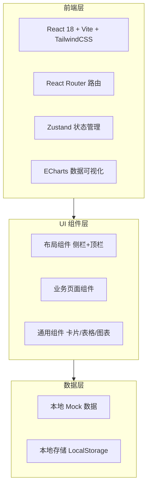
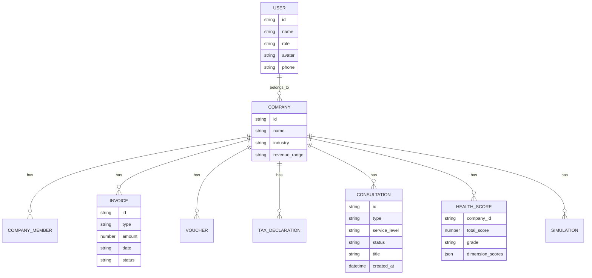

# 企管家 SaaS 管理后台 - 技术架构文档

## 1. 架构设计



本系统为纯前端 SaaS 管理后台原型，使用本地 Mock 数据模拟后端接口，所有数据存储于前端内存与 LocalStorage，聚焦于界面设计与交互体验。

## 2. 技术说明

- **前端框架**：React@18 + Vite（快速构建与热更新）
- **样式方案**：TailwindCSS@3（原子化 CSS，自定义主题色深蓝 #1E3A5F + 金色 #D4AF37）
- **路由**：React Router@6（嵌套路由 + 权限路由守卫）
- **状态管理**：Zustand（轻量级全局状态，管理登录态、企业上下文、AI 会话）
- **数据可视化**：ECharts（折线/柱状/饼图/雷达/漏斗/仪表盘）
- **图标库**：Lucide React（线性图标，2px 描边风格）
- **字体**：Noto Sans SC（中文）+ Inter（英文/数字 Tabular Nums）
- **初始化工具**：Vite `npm create vite@latest`
- **后端**：无（使用 Mock 数据，预留 API 接口结构便于后续对接）
- **数据库**：无（LocalStorage 持久化登录态与用户偏好）

## 3. 路由定义

| 路由 | 用途 |
|------|------|
| `/login` | 登录页（账号密码/验证码/扫码三种方式） |
| `/` | 老板驾驶舱首页（经营健康评分、关键数据、预警、快捷入口） |
| `/workspace` | 工作台（十大服务板块卡片墙） |
| `/ai-assistant` | AI 经营助手（聊天对话界面） |
| `/finance` | 智能财务中心（仪表盘、发票、凭证、报表） |
| `/finance/invoices` | 发票管理（OCR 入账） |
| `/finance/vouchers` | 凭证管理 |
| `/tax` | 智能税务中心（概览、算税、申报、风控） |
| `/tax/calendar` | 申报日历 |
| `/tax/risk` | 税务风控 |
| `/consultation` | 三务咨询中心（税务/法务/财务/三务联动） |
| `/dashboard` | 数据看板（自定义图表布局） |
| `/growth` | 智能成长中心（健康诊断、决策沙盘、市场雷达） |
| `/growth/simulation` | 决策沙盘 |
| `/hr` | 人力资源管家 |
| `/supply-chain` | 供应链与进销存 |
| `/marketing` | 营销获客中心 |
| `/legal` | 法律合规中心 |
| `/policy` | 政策服务大厅 |
| `/finance-service` | 金融服务超市 |
| `/settings` | 个人中心/系统设置（企业信息、成员、权限、订阅） |
| `/settings/members` | 成员管理 |
| `/settings/subscription` | 订阅套餐 |

## 4. 数据模型（Mock 数据结构）

### 4.1 核心数据模型定义



### 4.2 Mock 数据文件组织

```
src/
├── mock/
│   ├── user.js          # 用户与企业信息
│   ├── dashboard.js     # 驾驶舱数据（评分、营收、预警）
│   ├── finance.js       # 财务数据（发票、凭证、报表）
│   ├── tax.js           # 税务数据（申报、风险、日历）
│   ├── consultation.js  # 咨询记录
│   ├── growth.js        # 成长数据（评分、模拟、市场）
│   └── workspace.js     # 工作台板块数据
├── store/
│   ├── authStore.js     # 登录态
│   ├── appStore.js      # 企业上下文、侧栏状态
│   └── chatStore.js     # AI 会话历史
```

## 5. 项目目录结构

```
qijia-saas/
├── index.html
├── package.json
├── vite.config.js
├── tailwind.config.js
├── postcss.config.js
├── src/
│   ├── main.jsx
│   ├── App.jsx
│   ├── index.css
│   ├── routes/
│   │   └── index.jsx          # 路由配置
│   ├── layouts/
│   │   ├── AuthLayout.jsx     # 登录布局
│   │   └── MainLayout.jsx     # 主布局（侧栏+顶栏+内容）
│   ├── components/
│   │   ├── Sidebar.jsx        # 左侧导航
│   │   ├── Topbar.jsx         # 顶部栏
│   │   ├── StatCard.jsx       # 数据统计卡
│   │   ├── RadarChart.jsx     # 六维雷达图
│   │   ├── AIAssistant.jsx    # AI 助手浮窗
│   │   └── ... 
│   ├── pages/
│   │   ├── Login.jsx
│   │   ├── Dashboard.jsx
│   │   ├── Workspace.jsx
│   │   ├── AIAssistant.jsx
│   │   ├── Finance.jsx
│   │   ├── Tax.jsx
│   │   ├── Consultation.jsx
│   │   ├── DataBoard.jsx
│   │   ├── Growth.jsx
│   │   ├── HR.jsx
│   │   ├── SupplyChain.jsx
│   │   ├── Marketing.jsx
│   │   ├── Legal.jsx
│   │   ├── Policy.jsx
│   │   ├── FinanceService.jsx
│   │   └── Settings.jsx
│   ├── mock/
│   ├── store/
│   └── utils/
└── public/
```

## 6. 设计主题配置

```javascript
// tailwind.config.js 主题色
colors: {
  primary: {
    DEFAULT: '#1E3A5F',    // 深蓝主色
    light: '#2C5282',      // 悬浮态
    dark: '#15293F',       // 侧栏深色
  },
  accent: {
    DEFAULT: '#D4AF37',    // 金色强调
    light: '#E5C158',
  },
  success: '#38A169',
  warning: '#DD6B20',
  danger: '#E53E3E',
  info: '#3182CE',
  card: '#F7F8FA',
}
```
